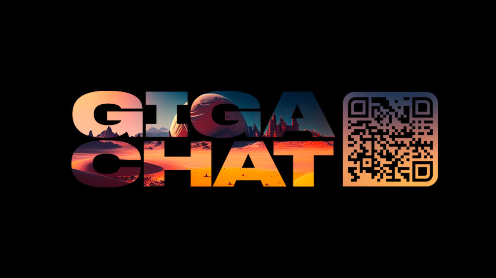

<h1 align='center'>GIGA DIALOGUE</h1>



<br>

<p>This repo will help you make a dialogue between two different
GigaChat instances with different tasks to accomplish. All text
made using GigaChat will be run through a TTS when you start
<code>main.py</code> file.</p>


<h2>Installation</h2>

- Clone this repository: `https://github.com/plugg1N/giga-dialogue.git`
```bash
git clone https://github.com/plugg1N/giga-dialogue.git
```


- Install the requirements
```bash
pip install -r requirements.txt
```


- Edit the `Messages/messages.py` file in order to change the theme of the
dialogue and tweak the roles of each speaker

- Edit the `temperature`, `top_p`, `porfanity_check` and other parameters
in `main.py` file. You can tweak answers of the LLM in order to get different
outputs.

<br>

<h2>How to run?</h2>
<p>Simply run <code>main.py</code>. If there any more dependencies that need to
be installed: install them by reading the trace.</p>

```python
python3 main.py
```

Dialogue will be saved in `chat_log.txt`. If you want to rerun the file - 
clear the _log file_ and start again.

<br>

<h2>History folder</h2>

You can save all your dialogues in `History` folder if you want
to share your findings with you friends :)